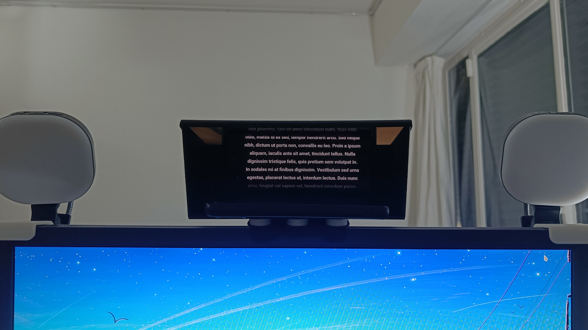
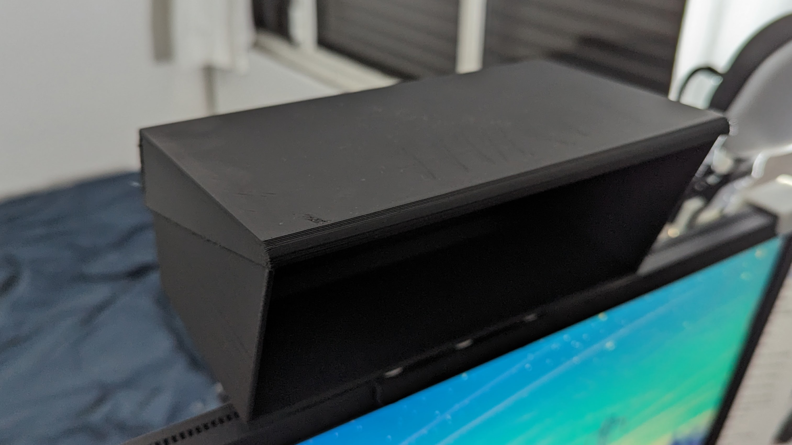

# Webcam Teleprompter

A teleprompter to display text with a phone, in front of a webcam.

I use a Logitech C920 ([without hinge](https://www.youtube.com/watch?v=a39iWgSwaBk)), but it is compatible with other webcams.

## Build

1. You will need to buy a glass plate measuring 20cm by 11cm (or cut one), with a thickness of 2mm. I personally added a one-way film, but this is not obligatory.

2. Print the 3D parts. You will need to print the following parts:
- `prompteurCaisse.stl` (x1)
- `prompteurCouvercle.stl` (x1)
- `prompteurSupport_Caisse.stl` (x1 if you want to place the teleprompter over a screen. 🚨 This one is suitable for my screen, so you probably need to ajust it.)

I print with a Creality K1, in PLA, with 15% and 30% infill.

2. Sile the glass plate into the notch.

3. Place the webcam just behind the glass. Pass the cable through the hole.

4. Close the teleprompter with the cover to not let light enter into the webcam side.

## How to use
Place your phone on the plate. The light from your phone screen will be reflected on the glass and will be visible to you, but not to the webcam.   
Open your text application (for exemple: [ElegantTeleprompter](https://play.google.com/store/apps/details?id=com.ayman.elegantteleprompter)).

