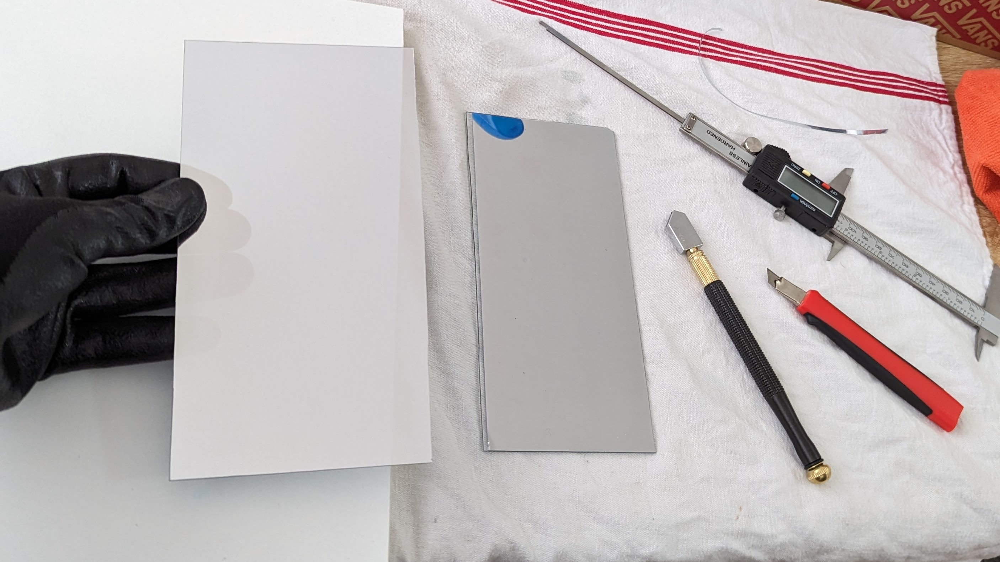
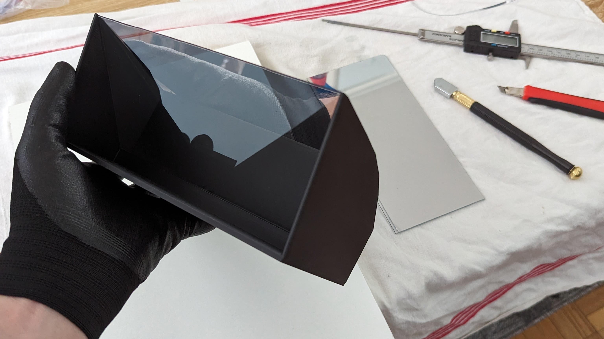

# Webcam Teleprompter

I use a Logitech C920, but it is compatible with other webcams.

You will need to buy a glass plate measuring 20cm by 20cm, with a thickness of 2mm. I personally added a one-way film to test, but this is not obligatory.

If necessary, adjust the 3D model of the screen clip. This one is suitable for my screen.

I print with a Creality K1, in PLA, with 15% and 30% infill.

## How to use
Place your phone on the plate, with your text application open. I use the app "[ElegantTeleprompter](https://play.google.com/store/apps/details?id=com.ayman.elegantteleprompter)" on Android.

## More pictures
From the back, it's look like this:

Inside, if you remove the lid, it's look like this:

So, without the lid, you can see the webcam through the glass:

